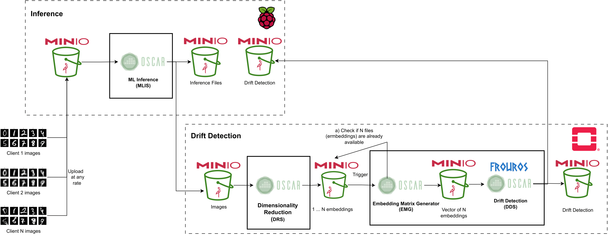

# Serverless data drift detection

This repository contains the code to reproduce the training and deployment of the proposed serverless architecture for data drift detection of the paper "Efficient and scalable data drift detection in machine learning sytems with serverless computing".


## Installation
Create a virtual environment and install the required packages for the training and testing of the model:
```bash
python3 -m venv .venv
source .venv/bin/activate
pip install -r ml/mnist/requirements.txt
```

## Data

The data used for training and testing the model is the [MNIST](http://yann.lecun.com/exdb/mnist/) dataset. The data is downloaded and preprocessed using the `ml/mnist/download.py` script. The preprocessed data is stored in the `ml/mnist/data` directory.
```bash
python ml/mnist/download.py
```

## Training
To train the model, autoencoder and fit the detector, run the following command:
```bash
python ml/mnist/training.py
```
This will create a `cnn.pt` (inference model), `detector.pkl` (data drift detector), `encoder.pt` (dimensionality reduction model) and `transformer.pt` (preprocessing object) files in the `ml/mnist/objects` directory.

In addition, `cnn.pt` and `transformer.pt` are stored in the `model_inference_api/app/objects` directory. `encoder.pt` and `transformer.pt` are stored in the `dimensionality_reduction_api/app/objects` directory. `detector.pkl` is stored in the `detector_api/app/objects` directory.

## Testing
To test the model and obtain the results presented in Table 1, run the following command that loads the objects generated by the training script:
```bash
python ml/mnist/testing.py
```

## Services architecture



### Deployment

TODO (OSCAR)


### (Optional) Setup for building and pushing the services images

To allow to build the services images for multiple architectures, we use [buildx](https://docs.docker.com/buildx/working-with-buildx/). To enable it, run the following command:
```bash
make add-multi-arch-builder
```

#### ML Inference Service (MLIS)

The ML Inference Service can be build (for arm64 and amd64) and pushed to Docker Hub using the following commands:
```bash
make build-push-model-inference
``` 

#### Dimensionality Reduction Service (DRS)

The Dimensionality Reduction Service can be build (for arm64 and amd64) and pushed to Docker Hub using the following commands:
```bash
make build-push-dimensionality-reduction
``` 

#### Data Drift Detection Service (DDS)

The Data Drift Detection Service can be build (for arm64 and amd64) and pushed to Docker Hub using the following commands:
```bash
make build-push-data-drift-detection
```